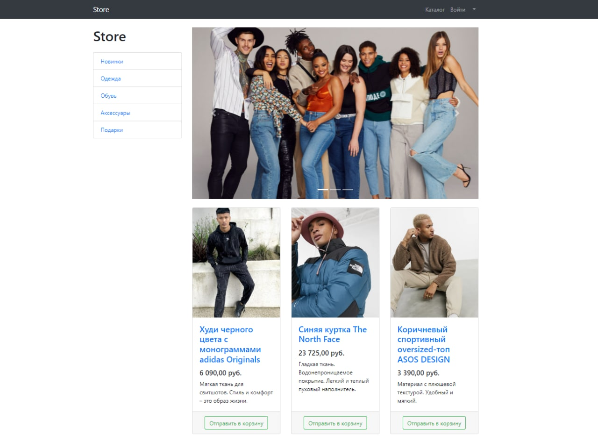
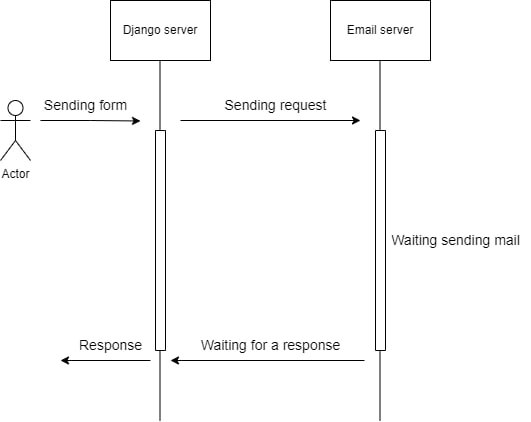
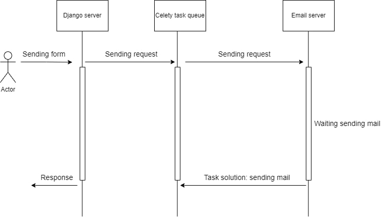

# The Dress Store
Website for clothing store.
## Screenshots
___

### Stacks
+ Python
+ Django, DRF
+ PostgreSQL
+ [Celery](#Celery)
+ Redis
### Functions
+ Register/Login users
+ Authorization with GitHub
+ Users have a profile
+ Possibility to add goods to basket
___
### Celery
On project used `celery` with message broker `redis` for optimization email sending after registration users.  
  
Before using **Celery**:  
  
After registration, the user had to wait for a response after sending the letter with email verification. Only after that was redirected to the login page.  
  
After using **Celery**:  
  
Now the user is immediately redirected to the login page. And the task of sending a verification letter is taken over by `celery`  
