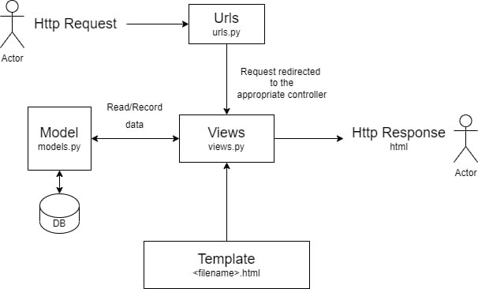
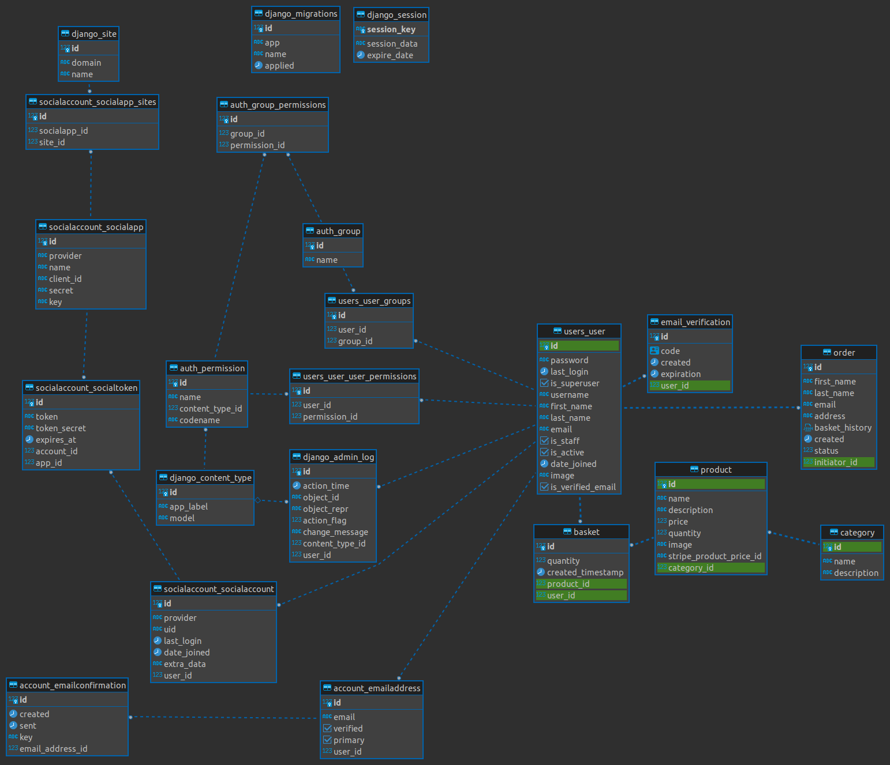
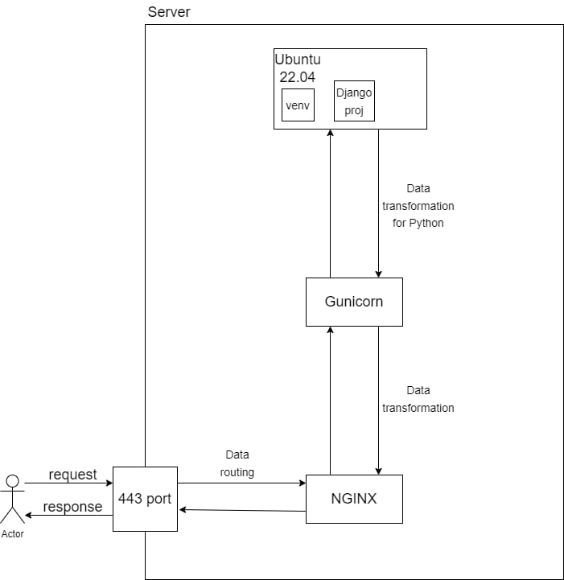

# The Dress Store
Website for clothing store.
## Screenshots
___

## Stacks
+ [Django](#Django), DRF
+ [PostgreSQL](#PostgreSQL)
+ [Celery](#Celery), Redis
+ [Deploy](#Deploy): NGINX, Gunicorn
### Functions
+ Register/Login users
+ Confirm email address
+ Authorization with GitHub
+ Users have a profile
+ Add goods to basket
+ Payment for goods through stripe payment system.
+ Purchase history
___
### Django
Django follows the Model-View-Template(MVT) design pattern. MVT determines the total structure and workflow of a Django application.  
  
In an MVT architecture:
+ **Model** manages the data and is represented by a database. A model is basically a database table. 
+ **View** receives HTTP request and sends HTTP response. A view interacts with a model and template to complete a response.
+ **Template** is basically the front-end layer and the dynamic HTML component of a Django application.  
  
*Diagram:*  

 
___
### PostgreSQL
Database shema:  
 
___
### Celery
On project used `celery` with message broker `redis` for optimization email sending after registration users.  
  
Before using **Celery**:  
  
  
After registration, the user had to wait for a response after sending the letter with email verification. Only after that was redirected to the login page.  
___  
After using **Celery**:  
  
  
Now the user is immediately redirected to the login page. And the task of sending a verification letter is taken over by `celery`  
___  
### Deploy  
For deploy a Django application on the production environment we will need a powerful and more secure web server.  
In this case, we use `Gunicorn` as a WSGI(Web Server Gateway Interface) HTTP server and `Nginx` as a proxy server to serve application securely with robust performance.  
  
*Diagram:*  

  
___

